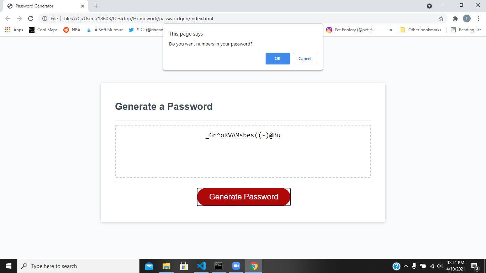

# passwordgen
Password Generator created using Java Script

https://pratikpatel-code.github.io/passwordgen/

#
## Project Overview:
AS AN employee with access to sensitive data
I WANT to randomly generate a password that meets certain criteria
SO THAT I can create a strong password that provides greater security

#
## Project Goals:
1. Clicking the generate button will prompt criteria to make passord
2. Prompts will appear one after another with user choice accepted
3. When all prompts are completed, a password will generate

#

#

## Conributers
[Pratik Patel](https://github.com/PratikPatel-Code/)

#
## Built With:
[Visual Studio](https://visualstudio.microsoft.com/)

[CSS](https://www.w3.org/TR/CSS/#css)

[JavaScript](https://www.javascript.com/)

#
## Links:
[Email](pratikpatel_85@yahoo.com)

[Github Profile](https://github.com/PratikPatel-Code/)

[Pratik Patel Portfolio](https://pratikpatel-code.github.io/passwordgen/)